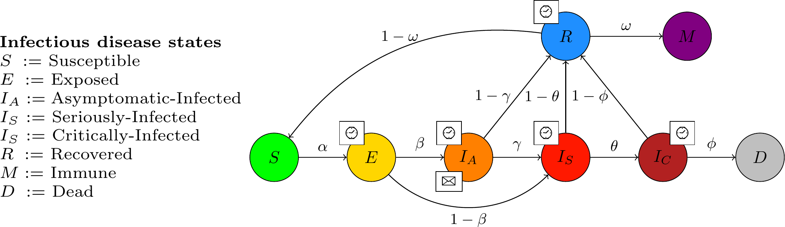

# INFEKTA
**INFEKTA—An agent-based model for transmission of infectious diseases: 
The COVID-19 case in Bogotá, Colombia.**

INFEKTA combines the transmission dynamic of a specific disease, (according to parameters found in the literature) with demographic information (population density, age, and genre of individuals) of geopolitical regions of the real town or city under study. Agents (virtual persons) can move, according to its mobility routines and the enforced social distancing policy, on a complex network of accessible places defined over a Euclidean space representing the town or city. The transmission dynamics of the COVID-19 under different social distancing policies in Bogotá city, the capital of Colombia, is simulated using INFEKTA with one million virtual persons.
  
[](https://journals.plos.org/plosone/article?id=10.1371/journal.pone.0245787)

## Directories
- Simulator Anylogic: contains the simulation project file (Anylogic 8.X). This project is currently running
with 1000 virtual agents.
- Simulator Python: contains the simulation project file (Python 3.X). This project is currently running
with 1000000 virtual agents.
- Technical report : explains the methodology used for the modeling. 

## Copyright
The Copyright of the INFEKTA belongs to the ALIFE and MIDAS research groups at 
Universidad Nacional de Colombia. 
You are free to use the INFEKTA for research purposes. 
All publications which use this model or any code in the model should acknowledge the use of **INFEKTA** and reference
_"Gomez, J., Prieto, J., Leon, E., & Rodríguez, A. (2021). 
INFEKTA—An agent-based model for transmission of infectious diseases: 
The COVID-19 case in Bogotá, Colombia. PloS one, 16(2), e0245787."_.

```
@article{gomez2021infekta,
  title={INFEKTA—An agent-based model for transmission of infectious diseases: The COVID-19 case in Bogot{\'a}, Colombia},
  author={Gomez, Jonatan and Prieto, Jeisson and Leon, Elizabeth and Rodr{\'\i}guez, Arles},
  journal={PloS one},
  volume={16},
  number={2},
  pages={e0245787},
  year={2021},
  publisher={Public Library of Science San Francisco, CA USA}
}
```  