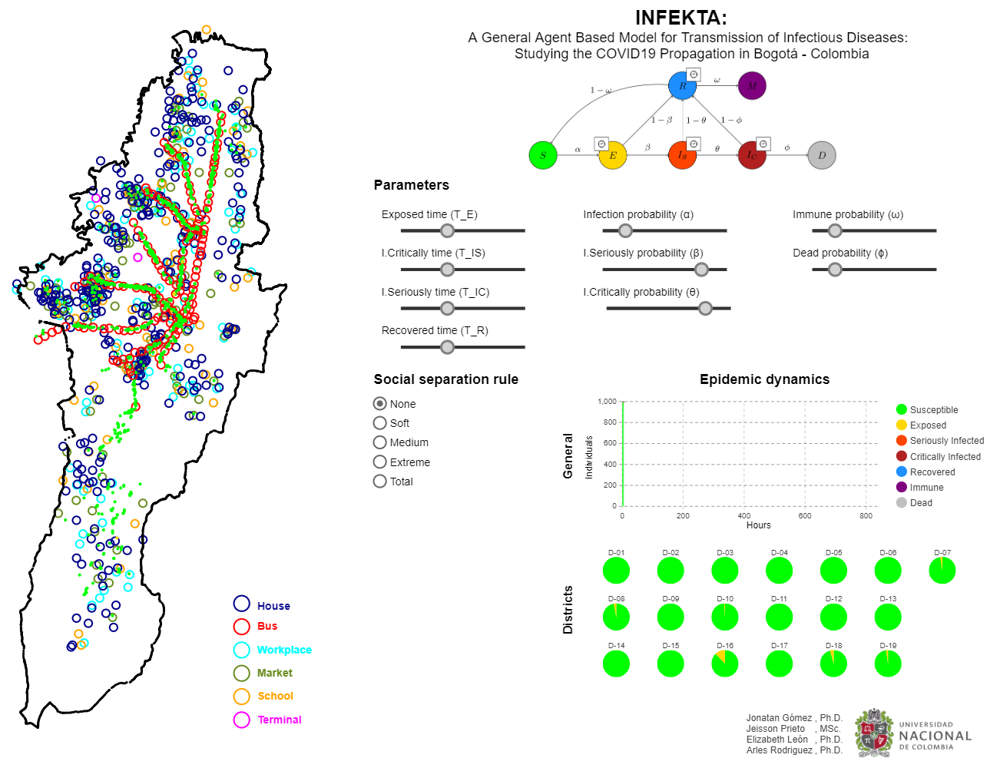

# INFEKTA
**A General Agent-based Model for Transmission of Infectious Diseases: 
Studying the COVID-19 Propagation in Bogotá - Colombia**

INFEKTA models the disease transition at the person level and takes 
into consideration individual infection disease incubation periods and evolution, 
medical preconditions, age, daily routines (movements from house to destination places and back, 
including transportation medium if required), and enforced social separation policies. 
  
[](https://cloud.anylogic.com/model/9806d370-f0a8-48d1-b3e1-3537721b39ba?mode=SETTINGS)

## Directories
- Simulator : contains the simulation project file (Anylogic 8.X).
- Technical report : explains the methodology used for the modeling. 

## Copyright
The Copyright of the INFEKTA belongs to the ALIFE and MIDAS research groups at 
Universidad Nacional de Colombia. 
You are free to use the INFEKTA for research purposes. 
All publications which use this model or any code in the model should acknowledge the use of **INFEKTA** and reference
_"Gomez, J., Prieto, J., Leon, E., & Rodriguez, A. (2020). 
INFEKTA: A General Agent-based Model for Transmission of Infectious Diseases: 
Studying the COVID-19 Propagation in Bogota-Colombia. medRxiv."_.

```
@article{gomez2020infekta,
  title={INFEKTA: A General Agent-based Model for Transmission of Infectious Diseases: Studying the COVID-19 Propagation in Bogota-Colombia},
  author={Gomez, Jonatan and Prieto, Jeisson and Leon, Elizabeth and Rodriguez, Arles},
  journal={medRxiv},
  year={2020},
  publisher={Cold Spring Harbor Laboratory Press}
}
```  